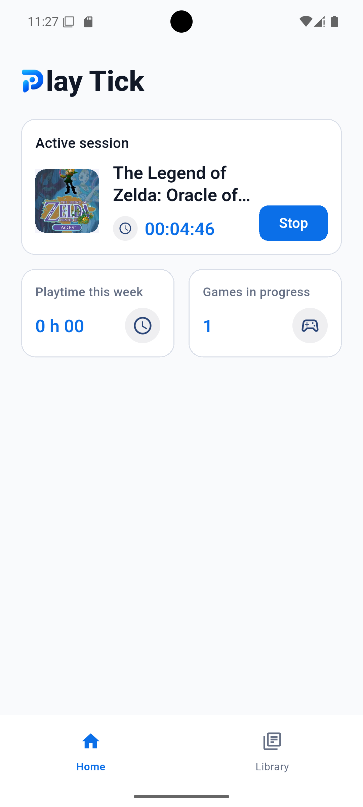
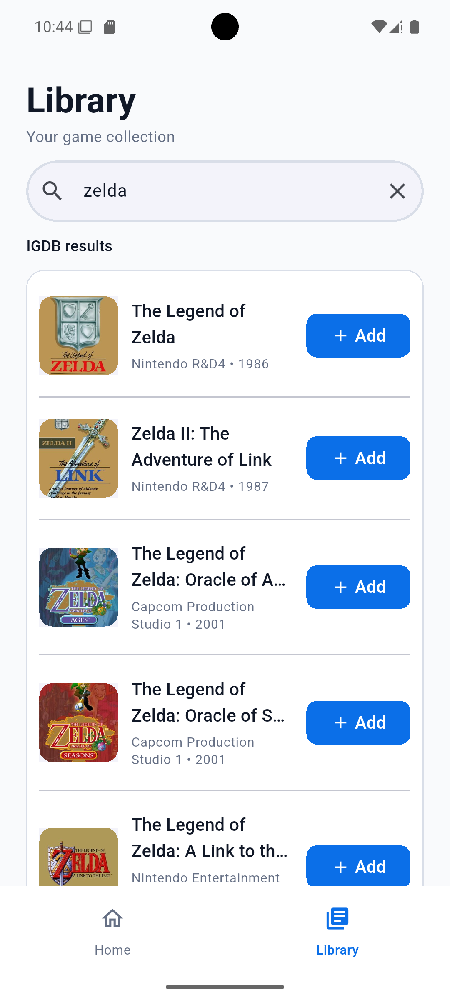
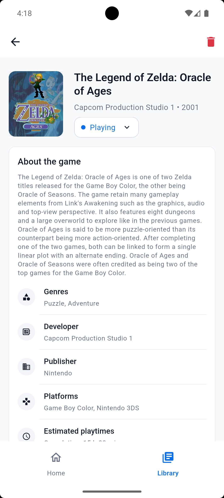
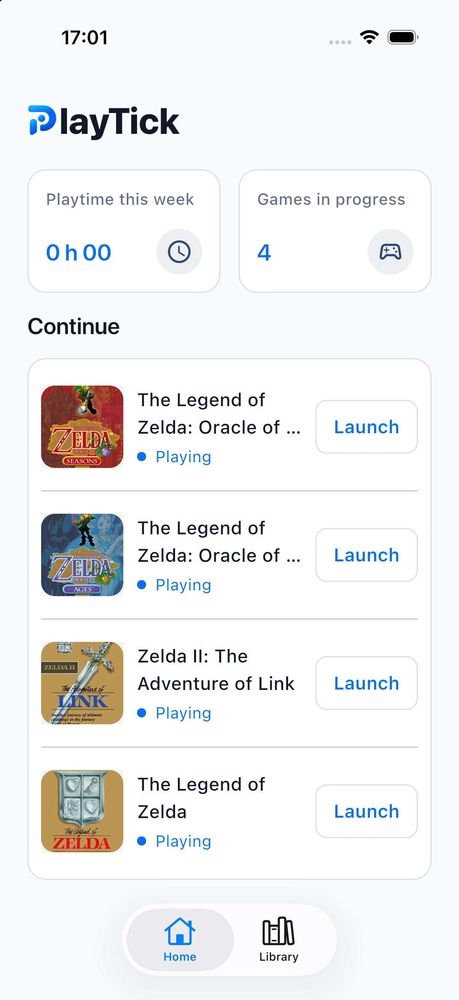
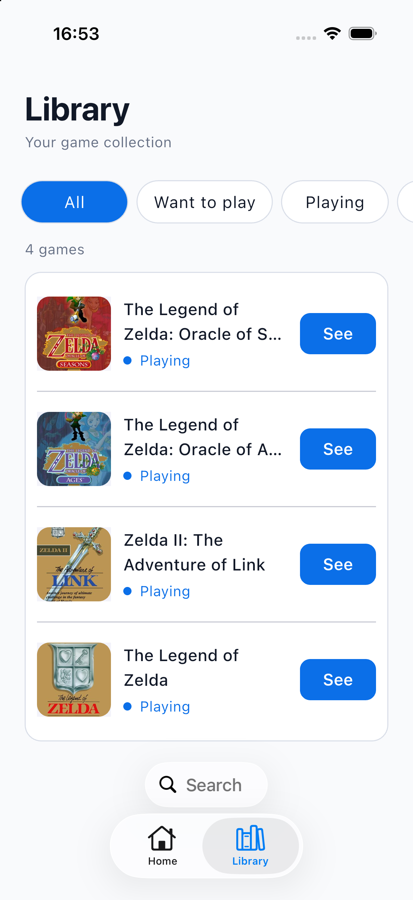
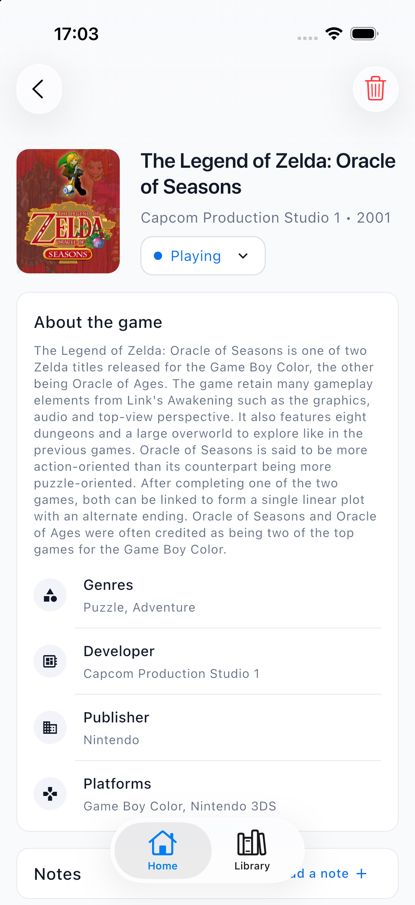

# PlayTick

Your game library, your sessions, your playtime.

**Android · iOS · Flutter · Riverpod · Drift / SQLite · IGDB · FR / EN**

PlayTick is an Android and iOS app for organizing your video game library and tracking the time you actually spend playing. Find a game, add it to your collection, choose its status, and record your sessions using a timer or manual entry.

This portfolio project implements a complete product flow: **pick a game → play → log a session → track your time**. Version 1 focuses on personal use, with no account required and user data stored on the device.

## Preview

| Home and session timer                                                                       | IGDB search                                                                        | Game details                                                                                    |
| -------------------------------------------------------------------------------------------- | ---------------------------------------------------------------------------------- | ----------------------------------------------------------------------------------------------- |
|  |  |  |

_Android, English._

| Home                                                                                         | Library and native search                                                              | Game details                                                                                          |
| -------------------------------------------------------------------------------------------- | -------------------------------------------------------------------------------------- | ----------------------------------------------------------------------------------------------------- |
|                         |  |  |

_iOS, English. The interface also supports French; see the localization section below._

## Features

- **Personal library**: add games from IGDB, prevent duplicates, and filter by status — Want to play, Playing, Completed, or Dropped.
- **Integrated search**: browse local library matches and IGDB results on the same screen, with a 300 ms debounce for remote searches.
- **Session tracking**: run one timer at a time, adjust the duration before saving, add sessions manually, and edit or delete previous sessions.
- **Dashboard**: see recorded playtime for the current week, the number of games in progress, and quick access to the session timer.
- **Game details**: view cover art, descriptions, genres, platforms, developers, publishers, and estimated playtimes when available from IGDB.
- **Personal notes**: keep notes for each game and optional notes for individual sessions.
- **French and English interface**: localized labels, messages, dates, and durations based on the supported device language.

Version 1 targets **Android and iOS in light mode**. Its scope focuses on individual tracking: no accounts, cloud sync, console library imports, or social features. The domain, local library, and session rules are shared. On iOS 26, the tab bar, the library search field, and the game-details back and delete buttons use native Liquid Glass. The game-details top bar is a fading blur so the page scrolls underneath it. Earlier iOS versions keep the same behavior with standard controls. Android keeps the Material search field and icons.

## Product and technical decisions

### Sessions as the source of truth

A game's total playtime is calculated from its saved sessions. Editing or deleting a session updates the totals; no separate, arbitrary completion percentage is maintained. The game's status remains a user choice, independent of time spent playing.

### A timer backed by a persisted timestamp

The active session's start time (`startedAt`) is stored locally. Elapsed time is recalculated from the current time, allowing the session to be restored after the app is backgrounded or closed without a permanent background service. When stopping a session, users can adjust its duration and add a note before saving.

### Personal data stored locally

Drift stores added games, their metadata, statuses, sessions, and notes in SQLite. Browsing and managing the library therefore does not depend on an IGDB response. Searching for new games requires a connection; cover images are loaded from remote URLs and have no dedicated offline storage.

## Tech stack and architecture

| Area                   | Technology                                           | Purpose                                                 |
| ---------------------- | ---------------------------------------------------- | ------------------------------------------------------- |
| Application            | Flutter / Dart                                       | Android and iOS interfaces and application logic        |
| State and dependencies | Riverpod with code generation                        | Providers, asynchronous state, and repository injection |
| Navigation             | GoRouter                                             | Home, library, and game detail routes                   |
| Persistence            | Drift / SQLite                                       | Relational data, migrations, and reactive streams       |
| Game catalog           | IGDB, `http` client, Twitch OAuth                    | Search and metadata retrieval                           |
| Localization           | `flutter_localizations`, ARB, `intl`                 | French and English interface text and formatting        |
| Quality                | `flutter_test`, `very_good_analysis`, `import_rules` | Tests and static analysis rules                         |

The code follows a **feature-first architecture**, with three distinct responsibilities:

- `presentation`: screens, widgets, providers, and display formatting.
- `domain`: business models, calculation rules, and repository contracts.
- `data`: storage and network implementations, Drift tables, and mapping IGDB responses to domain models.

```text
lib/
├── app/                         # Application, theme, and navigation
├── core/                        # Shared assets and widgets
├── features/
│   ├── home/presentation/       # Dashboard and active session
│   └── library/
│       ├── presentation/        # Library, game details, notes, and sessions
│       ├── domain/              # Models and repository contracts
│       ├── data/
│       │   ├── database/        # Drift database and migrations
│       │   ├── local/           # Tables and converters
│       │   └── igdb/            # API client and DTOs
│       └── providers/           # Repository wiring
└── l10n/                        # ARB catalogs and generated translations
```

Screens access data through providers and the `LibraryRepository` and `LibrarySearchRepository` contracts. `DriftLibraryRepository` manages local data, while `IgdbClient` implements remote search. This separation makes business rules, persistence, API integration, and screens independently testable. Drift streams feed Riverpod to update the interface when data changes.

## Localization: FR / EN interface and IGDB data

**Interface language and catalog content language are separate responsibilities.** PlayTick owns its interface text; IGDB remains the source of game metadata.

### Application-owned translations

The `[app_fr.arb](lib/l10n/app_fr.arb)` and `[app_en.arb](lib/l10n/app_en.arb)` catalogs contain interface translations. Flutter generates localization classes through `flutter gen-l10n`. The interface follows the device language, falling back to English when no supported language matches.

Actions, statuses, messages, and date or duration formatting are localized. Known IGDB genres are also mapped to translated labels in the presentation layer; unknown genres retain their source labels.

### Metadata supplied by IGDB

PlayTick uses localized IGDB values when available and falls back to source data when they are missing. In v1, this selection applies to **game titles and cover art** through `game_localizations`:

| Data                               | Behavior in v1                                                                                                                    |
| ---------------------------------- | --------------------------------------------------------------------------------------------------------------------------------- |
| Title and cover art                | On a device set to French, prefer an IGDB variant for the `EU` region. For English and other device languages, use source values. |
| Missing regional value             | Fall back independently for each field: a regional title can be used with the source cover, and vice versa.                       |
| Description (`summary`)            | Preserve the text supplied by IGDB, which is often in English.                                                                    |
| Studios, publishers, and platforms | Preserve source names without automatic translation.                                                                              |

A **European regional variant does not guarantee a French translation**. Available information varies between IGDB entries. Selected metadata is saved when a game is added to the library; changing the device language does not retranslate previously stored entries.

A French interface can therefore display an English game description. **This is an intentional architectural decision**: preserve catalog data without inventing translations or hiding useful information. External data mapping belongs to the `data` layer, while interface localization belongs to presentation.

Reference: [IGDB documentation — Game Localization](https://api-docs.igdb.com/#game-localization).

## Getting started

### Prerequisites

- A Flutter SDK that includes **Dart ≥ 3.13.1 and < 4.0.0**, as required by `pubspec.yaml`. The development environment uses Flutter **3.47.2** and Dart **3.13.2**.
- For Android: the Android SDK, a JDK compatible with the project's Gradle configuration (Java 17), and an emulator or a device with USB debugging enabled.
- For iOS: Xcode, with a simulator or device on iOS 15 or later. Liquid Glass requires iOS 26.
- IGDB/Twitch credentials to search the game catalog.

### 1. Clone the repository and install dependencies

```sh
git clone https://github.com/svelhinh/playtick.git
cd playtick
flutter doctor
flutter pub get
```

Resolve any Android or iOS setup issues reported by `flutter doctor` before launching the app.

### 2. Configure IGDB

Create an application in the [Twitch developer console](https://dev.twitch.tv/console/apps), then obtain its **Client ID** and **Client Secret**. Follow the [official IGDB setup instructions](https://api-docs.igdb.com/#account-creation) for the required configuration.

Copy `.env.example` to `.env` at the repository root, then fill in:

```dotenv
IGDB_CLIENT_ID=your_client_id
IGDB_CLIENT_SECRET=your_client_secret
```

The `.env` file is ignored by Git. Its values are injected at compile time using `--dart-define-from-file` and read through `String.fromEnvironment`; the file is not loaded automatically at startup. The client obtains the Twitch OAuth token itself.

This setup supports running the portfolio project locally. Values embedded in a mobile app can be extracted from its binary: public distribution with shared credentials requires moving IGDB authentication to a server. That service is outside the scope of v1.

### 3. Generate code and run the app

```sh
flutter gen-l10n
dart run build_runner build --delete-conflicting-outputs
flutter devices
flutter run --dart-define-from-file=.env
```

If multiple devices are available, append `-d <device-id>` to the last command. After changing `.env`, stop and restart the app with this command to inject the updated configuration.

Without IGDB credentials, `flutter run` still opens the app and lets you use existing local data. Remote search and adding games from the catalog require the configuration above.

## Tests and checks

```sh
flutter analyze
flutter test
```

The test suite covers weekly playtime calculations, persistence and migrations, session rules, IGDB responses and errors, regional values and fallbacks, genre localization, and key screens and navigation. Tests use test dependencies and do not require real IGDB credentials.

After editing ARB files, run `flutter gen-l10n` again. After changing Drift tables or annotated providers, rerun `build_runner`.

## Credits

Game metadata and cover art are provided by [IGDB](https://www.igdb.com/). Game names and artwork belong to their respective rights holders.

## License

The source code is released under the [MIT License](LICENSE).

The PlayTick name and branding assets are not covered by the MIT License. Game metadata and artwork are provided by IGDB and remain the property of their respective rights holders.
